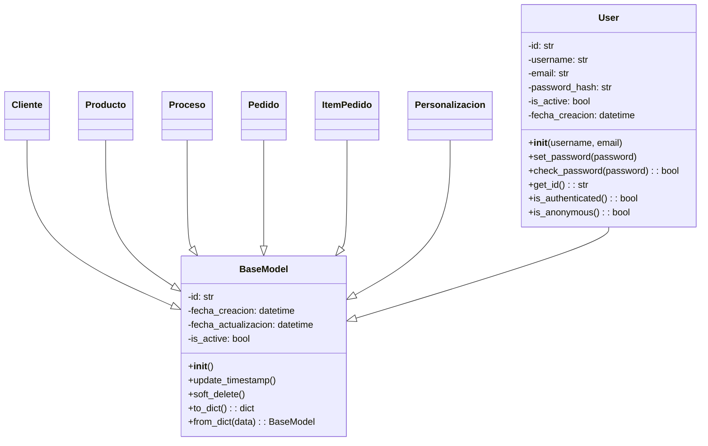

# DIAGRAMA DE CLASES UML - SISTEMA ALS

## Diagrama de Clases Principal

```mermaid
classDiagram
    class Cliente {
        -id: str
        -nombre: str
        -apellido: str
        -email: str
        -telefono: str
        -direccion: str
        -empresa: str
        -notas: str
        -tipo_cliente: str
        -nit: str
        -ciudad: str
        -departamento: str
        -total_pedidos: int
        -total_gastado: float
        -is_active: bool
        -fecha_creacion: datetime
        +__init__(nombre, email, telefono, direccion)
        +actualizar_estadisticas(monto_pedido)
        +get_nombre_completo(): str
        +get_info_contacto(): dict
        +puede_ser_eliminado(storage_service): tuple
        +soft_delete()
    }

    class Producto {
        -id: str
        -nombre: str
        -categoria: str
        -precio_base: float
        -descripcion: str
        -tallas_disponibles: list
        -colores_disponibles: list
        -posiciones_personalizacion: dict
        -veces_pedido: int
        -total_vendido: float
        -is_active: bool
        -fecha_creacion: datetime
        +__init__(nombre, categoria, precio_base)
        +actualizar_estadisticas(cantidad, precio_total)
        +get_posicion_nombre(posicion): str
        +is_talla_disponible(talla): bool
        +is_color_disponible(color): bool
        +agregar_talla(talla)
        +agregar_color(color)
        +soft_delete()
    }

    class Proceso {
        -id: str
        -tipo: TipoProceso
        -nombre: str
        -descripcion: str
        -precio_por_metro: float
        -precio_setup: float
        -precio_por_cm2: float
        -tipos_vinil: dict
        -tamaños_bordado: dict
        -is_active: bool
        -fecha_creacion: datetime
        +__init__(tipo, nombre, descripcion)
        +_configurar_proceso()
        +calcular_metros_necesarios(ancho, alto, cantidad): float
        +calcular_precio_dtf_sublimacion(ancho, alto, cantidad): float
        +calcular_precio_bordado(tamaño, cantidad): float
        +configurar_precios(**kwargs)
    }

    class Pedido {
        -id: str
        -cliente_id: str
        -numero_pedido: str
        -estado: EstadoPedido
        -prioridad: PrioridadPedido
        -fecha_pedido: datetime
        -fecha_entrega_estimada: datetime
        -porcentaje_utilidad: float
        -descuento_porcentaje: float
        -notas: str
        -items: list
        -num_items: int
        -subtotal: float
        -iva: float
        -total: float
        -utilidad: float
        -total_pagado: float
        -saldo_pendiente: float
        -pago_completo: bool
        -is_active: bool
        +__init__(cliente_id, descripcion, fecha_entrega)
        +_generar_numero_pedido(): str
        +calcular_totales(iva_porcentaje): void
        +cambiar_estado(nuevo_estado): void
        +is_atrasado(): bool
        +validar_cliente_existe(cliente_id, storage): tuple
    }

    class ItemPedido {
        -id: str
        -pedido_id: str
        -producto_id: str
        -talla: str
        -color: str
        -cantidad: int
        -precio_prenda: float
        -personalizaciones: list
        -subtotal: float
        -subtotal_personalizaciones: float
        -is_active: bool
        +__init__(producto_id, talla, color, cantidad, precio_prenda)
        +precio_base(): float
        +precio_total(): float
        +subtotal_total(): float
    }

    class Personalizacion {
        -id: str
        -item_pedido_id: str
        -proceso_id: str
        -precio_proceso: float
        -cantidad: int
        -subtotal: float
        -posicion: int
        -descripcion: str
        -ancho: float
        -alto: float
        -is_active: bool
        +__init__(proceso_id, precio_proceso, cantidad)
        +costo(): float
    }

    class TipoProceso {
        <<enumeration>>
        DTF
        SUBLIMACION
        BORDADO
        VINIL_TEXTIL
        SERIGRAFIA
    }

    class EstadoPedido {
        <<enumeration>>
        PENDIENTE
        EN_PROCESO
        COMPLETADO
        ENTREGADO
        CANCELADO
    }

    class PrioridadPedido {
        <<enumeration>>
        BAJA
        NORMAL
        ALTA
        URGENTE
    }

    class TamañoBordado {
        <<enumeration>>
        PEQUEÑO
        MEDIANO
        GRANDE
        EXTRA_GRANDE
    }

    %% Relaciones
    Cliente ||--o{ Pedido : "realiza"
    Pedido ||--o{ ItemPedido : "contiene"
    Producto ||--o{ ItemPedido : "se_solicita_en"
    ItemPedido ||--o{ Personalizacion : "tiene"
    Proceso ||--o{ Personalizacion : "se_aplica_en"
    
    Pedido --> EstadoPedido : "tiene"
    Pedido --> PrioridadPedido : "tiene"
    Proceso --> TipoProceso : "es_de_tipo"
    Proceso --> TamañoBordado : "usa_tamaños"
```

## Diagrama de Clases Detallado - Módulo de Autenticación



## Información Adicional

### Patrones de Diseño Utilizados:

1. **MVC (Model-View-Controller)**: Separación clara entre modelos, vistas (templates) y controladores (routes)

2. **Repository Pattern**: Implementado a través de StorageService para abstracción del acceso a datos

3. **Factory Pattern**: En la creación de formularios y modelos

4. **Observer Pattern**: En las actualizaciones de estadísticas de productos y clientes

### Principios SOLID:

- **Single Responsibility**: Cada clase tiene una responsabilidad específica
- **Open/Closed**: Extensible para nuevos tipos de procesos sin modificar código existente
- **Liskov Substitution**: Los modelos heredan correctamente de BaseModel
- **Interface Segregation**: Formularios específicos para cada entidad
- **Dependency Inversion**: StorageService abstrae el acceso a datos

### Características del Modelo:

1. **Soft Delete**: Eliminación lógica usando campo `is_active`
2. **Auditoría**: Timestamps de creación y actualización en BaseModel
3. **Validación de Integridad**: Validaciones antes de eliminaciones
4. **Cálculos Automáticos**: Totales y estadísticas se calculan automáticamente
5. **Extensibilidad**: Fácil agregar nuevos tipos de procesos y personalizaciones
