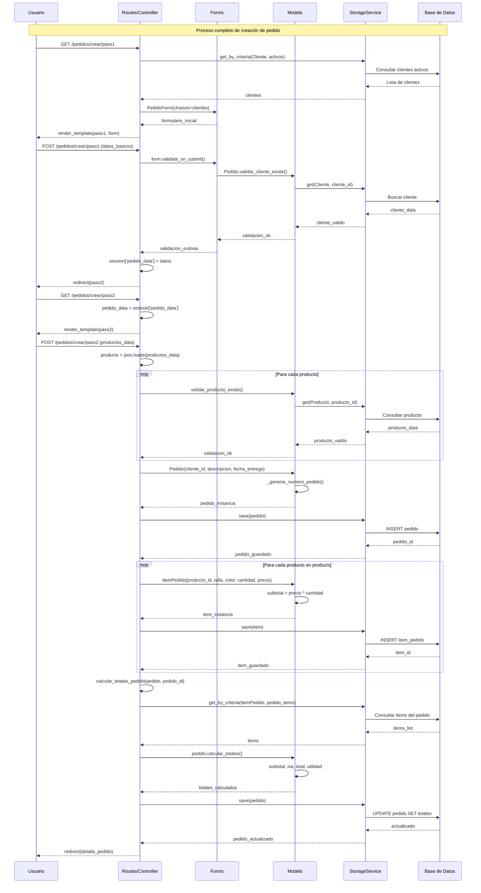
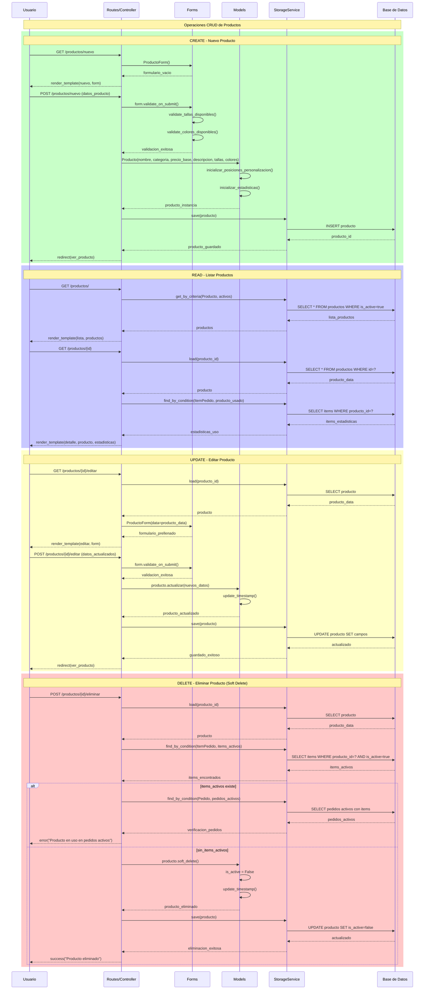
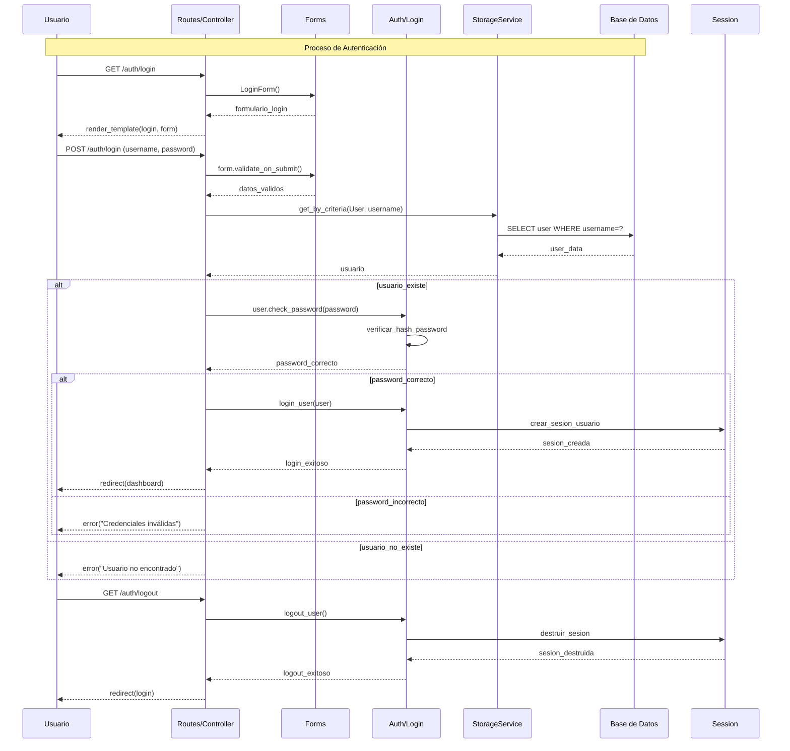
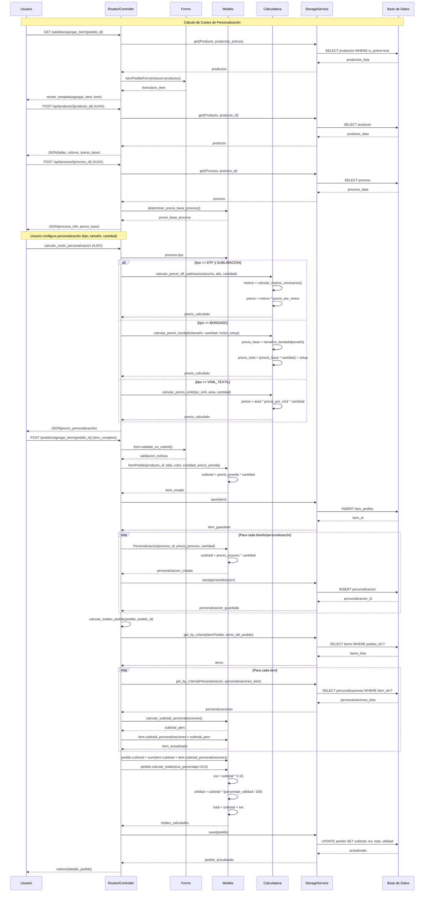
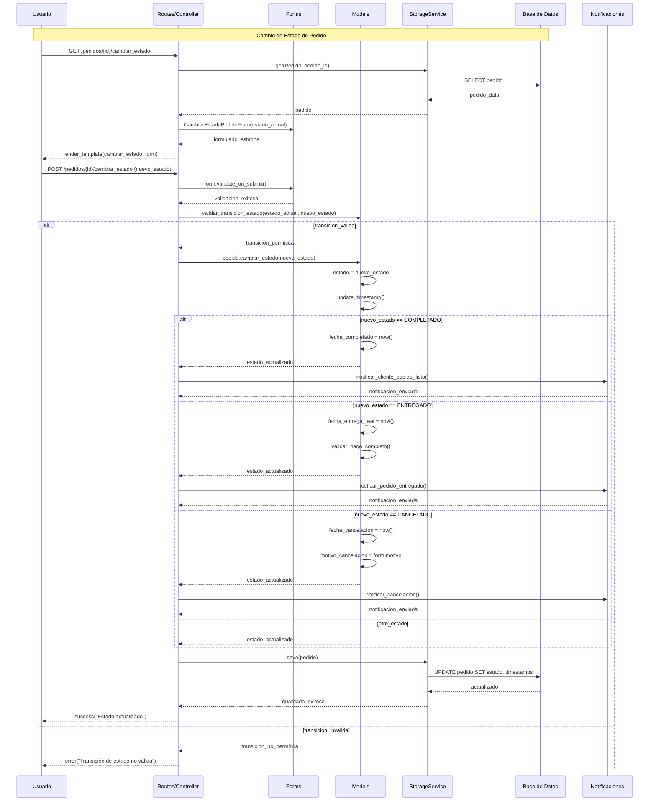

# DIAGRAMAS DE SECUENCIA - SISTEMA ALS

## 1. Diagrama de Secuencia - Crear Pedido Completo

## 2. Diagrama de Secuencia - Gestión de Productos (CRUD)

## 3. Diagrama de Secuencia - Autenticación de Usuario

## 4. Diagrama de Secuencia - Calculadora de Costes de Personalización

## 5. Diagrama de Secuencia - Gestión de Estados de Pedido

## Información Adicional

### Patrones de Interacción:

1. **Request-Response**: Comunicación HTTP estándar entre usuario y servidor
2. **AJAX/JSON**: Para actualizaciones dinámicas sin recarga de página
3. **Session Management**: Manejo de datos temporales durante procesos multi-paso
4. **Validation Chain**: Validación en múltiples capas (cliente, servidor, base de datos)

### Características de los Flujos:

1. **Integridad Referencial**: Validaciones antes de operaciones críticas
2. **Soft Delete**: Eliminación lógica para mantener historial
3. **Transaccionalidad**: Operaciones atómicas en procesos complejos
4. **Cálculos Automáticos**: Recálculo de totales tras cambios
5. **Notificaciones**: Comunicación de cambios de estado a usuarios

### Manejo de Errores:

- Validación en cada capa del sistema
- Rollback automático en caso de errores
- Mensajes descriptivos para el usuario
- Logging para auditoría y debugging
